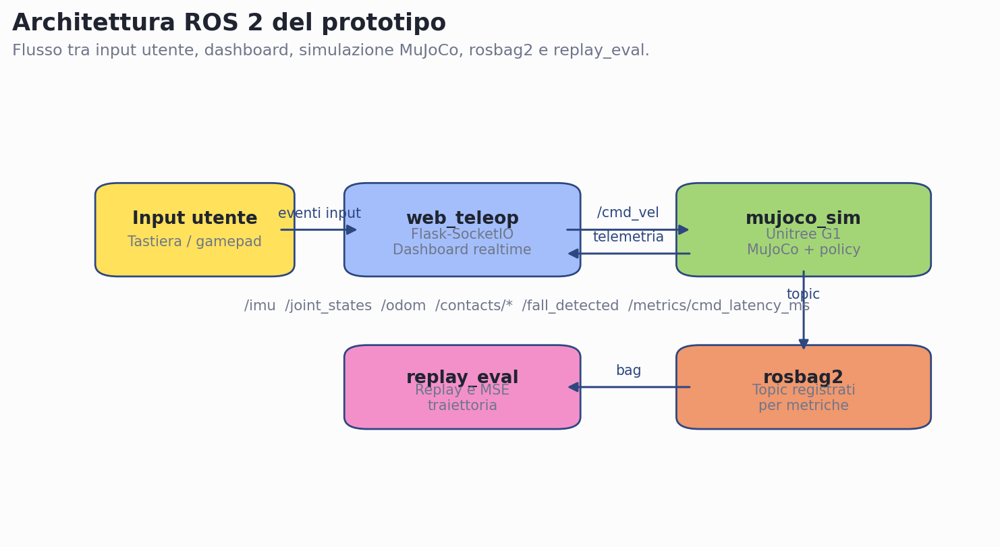
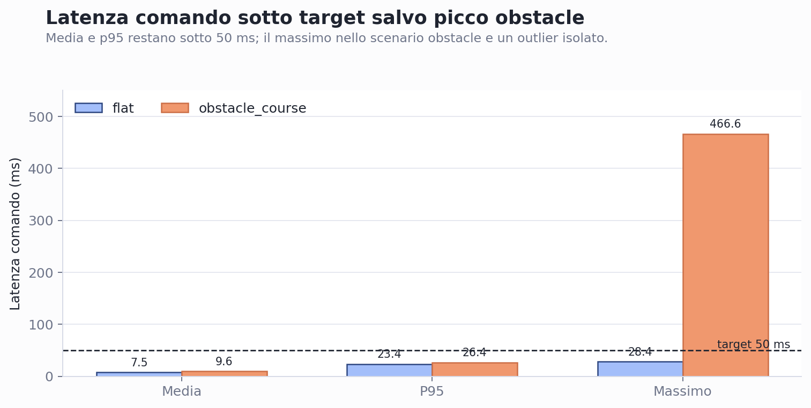
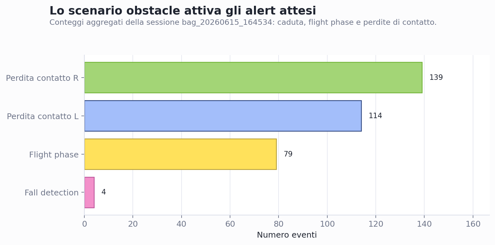
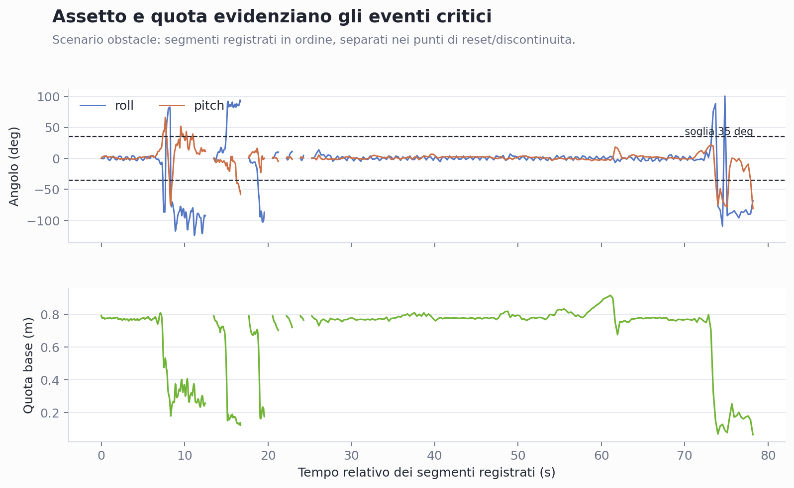

# Teleoperazione ROS 2 di Unitree G1 con dashboard realtime e validazione sperimentale

**Progetto di Robotica - Traccia 10**  
**Studente:** Ergys Perdeda  
**Anno accademico:** 2025/2026

## Abstract tecnico

Il progetto realizza un prototipo ROS 2 per teleoperare il robot umanoide Unitree G1
in simulazione MuJoCo, monitorarlo tramite dashboard web realtime e validarne il
comportamento con metriche sperimentali. Il sistema integra input tastiera/gamepad,
pubblicazione dei topic di telemetria, rilevamento di condizioni critiche e
registrazione delle sessioni tramite rosbag2. La validazione su piano regolare
mostra frequenza telemetrica media pari a 33.51 Hz, latenza comando p95 pari a
23.45 ms e replay deterministico con MSE nullo nella prova selezionata. Lo scenario
a ostacoli conferma la reattivita degli alert, con 4 eventi di caduta, 79 flight
phase e variazioni coerenti dei contatti ai piedi.

## 1. Obiettivo del progetto

Il progetto sviluppa un prototipo software per la teleoperazione del robot umanoide
Unitree G1 in ambiente simulato MuJoCo. L'obiettivo non e solo avviare una
simulazione, ma costruire una piccola architettura robotica integrata, osservabile
e misurabile: il robot viene controllato tramite comandi di velocita, la telemetria
viene pubblicata su topic ROS 2 e una dashboard web permette di monitorare in tempo
reale lo stato del sistema.

Il sistema realizzato copre quattro funzionalita principali:

- teleoperazione tramite tastiera o gamepad;
- simulazione fisica del robot Unitree G1 in MuJoCo;
- dashboard realtime per IMU, giunti, odometria, contatti dei piedi e alert;
- registrazione, replay e valutazione quantitativa delle sessioni sperimentali.

La validazione e stata condotta su due scenari: un piano regolare, usato per
misurare stabilita, latenza e fedelta del replay, e un percorso con ostacoli
elementari, usato per sollecitare contatti, flight phase e rilevamento caduta.

## 2. Architettura del sistema

L'architettura e basata su ROS 2 Jazzy e separa la simulazione, l'interfaccia utente
e l'analisi sperimentale in componenti distinti. Questa separazione rende il sistema
piu leggibile, permette di registrare i dati con rosbag2 e consente di sostituire o
estendere singoli moduli senza modificare l'intera applicazione.

Il nodo `mujoco_sim` gestisce il modello MuJoCo, applica la policy di locomozione
del robot, riceve i comandi di velocita e pubblica la telemetria. Il nodo
`web_teleop` integra il server Flask-SocketIO, la dashboard web e la lettura degli
input da tastiera o gamepad. Il nodo `replay_eval` riproduce una sessione registrata
e confronta la traiettoria ottenuta con quella acquisita durante la teleoperazione
live.

*Figura 1 - Architettura logica del sistema: `web_teleop` gestisce input e
dashboard, `mujoco_sim` esegue la simulazione e pubblica la telemetria, rosbag2
registra i topic e `replay_eval` valuta la fedelta del replay.*

I topic principali sono:

| Topic | Ruolo |
| --- | --- |
| `/cmd_vel` | Comando di velocita lineare e angolare verso il simulatore |
| `/imu` | Orientamento e stato inerziale del robot |
| `/joint_states` | Stato dei giunti del modello |
| `/odom` | Traiettoria stimata del robot |
| `/contacts/left`, `/contacts/right` | Stato di contatto dei piedi |
| `/fall_detected` | Segnalazione di caduta basata su roll/pitch |
| `/metrics/cmd_latency_ms` | Latenza tra comando utente e ricezione nel simulatore |
| `/sim_reset` | Reset della simulazione |

La dashboard web riceve i dati in tempo reale tramite WebSocket e visualizza grafici,
indicatori di stato e alert. Gli alert principali sono la caduta, rilevata quando
roll o pitch superano una soglia predefinita, e la flight phase, rilevata quando
entrambi i piedi perdono simultaneamente il contatto con il terreno.

## 3. Scenari sperimentali

Sono stati definiti due scenari di prova per separare la verifica del comportamento
nominale dalla verifica degli stati critici.

Lo scenario `flat` rappresenta un piano regolare. E stato usato per misurare la
frequenza di aggiornamento della telemetria, la latenza dei comandi e la fedelta
del replay. In questo caso il robot opera in condizioni controllate e la traiettoria
e adatta a una valutazione deterministica.

Lo scenario `obstacle_course` introduce una rampa bassa e piccoli step progressivi.
Questo scenario e stato usato per verificare la reattivita della dashboard rispetto
ai contatti dei piedi, alla perdita simultanea di contatto e al rilevamento di
caduta. La scena viene generata a runtime tramite un modulo Python dedicato, evitando
di mantenere manualmente file XML MuJoCo duplicati.

La registrazione delle prove avviene tramite rosbag2. Per ridurre l'impatto del
logging sulle prestazioni, il sistema supporta profili di registrazione con diverso
livello di dettaglio (`minimal`, `metrics`, `full`) e parametri per limitare frequenza
di telemetria, logging CSV e refresh del viewer.

## 4. Metriche di valutazione

Le metriche sono state scelte per coprire sia la reattivita del sistema sia la
qualita della validazione sperimentale.

| Metrica | Target | Motivazione |
| --- | --- | --- |
| Frequenza telemetria | >= 30 Hz | Aggiornamento fluido della dashboard |
| Latenza comando | < 50 ms | Teleoperazione reattiva |
| MSE replay | < 1e-4 m^2 | Riproducibilita della traiettoria registrata |
| Fall detection | almeno un evento nello scenario obstacle | Verifica alert di sicurezza |
| Flight phase | almeno un evento nello scenario obstacle | Verifica perdita simultanea contatti |
| Contatti piedi | variazioni coerenti con ostacoli | Validazione del rilevamento contatto |

Il replay e stato valutato sullo scenario `flat`, poiche il piano regolare consente
un confronto piu stabile tra traiettoria live e traiettoria riprodotta. Lo scenario
`obstacle_course` e stato invece usato per validare gli alert, dove la priorita e
osservare il corretto rilevamento degli eventi critici.

*Figura 2 - Confronto della latenza comando nei due scenari. Media e p95 restano
sotto il target di 50 ms; il massimo obstacle e trattato come picco isolato.*

## 5. Risultati sperimentali

I risultati selezionati sono archiviati in `docs/results/`. I dati grezzi completi,
inclusi rosbag e CSV di telemetria, sono conservati fuori repository per evitare di
versionare file binari o log voluminosi.

| Scenario | Metrica | Target | Valore osservato | Esito |
| --- | --- | --- | --- | --- |
| `flat` | Frequenza telemetria media/minima | >= 30 Hz | 33.51 Hz / 32 Hz | OK |
| `flat` | Latenza comando media/p95/max | < 50 ms | 7.53 / 23.45 / 28.35 ms | OK |
| `flat` | MSE replay | < 1e-4 m^2 | 0.00000000 m^2 | OK |
| `flat` | Stabilita assetto | nessuna caduta | roll 6.09 deg, pitch 6.53 deg, 0 cadute | OK |
| `obstacle_course` | Frequenza telemetria media | >= 30 Hz | 32.93 Hz | OK |
| `obstacle_course` | Latenza comando media/p95 | < 50 ms | 9.57 / 26.35 ms | OK |
| `obstacle_course` | Fall detection | >= 1 evento | 4 eventi | OK |
| `obstacle_course` | Flight phase | >= 1 evento | 79 eventi | OK |
| `obstacle_course` | Contatti piedi | eventi coerenti con ostacoli | left 114, right 139 perdite contatto | OK |

Nello scenario `flat` il sistema mantiene una frequenza di telemetria superiore al
target e una latenza di comando ampiamente inferiore a 50 ms. Il replay deterministico
ha prodotto un MSE pari a 0.00000000 m^2, indicando corrispondenza tra traiettoria
registrata e traiettoria riprodotta nel dominio di test scelto.

*Figura 3 - Conteggio degli eventi critici nello scenario `obstacle_course`: il
test sollecita fall detection, flight phase e perdite di contatto dei piedi.*

Nello scenario `obstacle_course` la dashboard ha rilevato eventi di contatto, flight
phase e caduta. La latenza media e il p95 restano sotto il target. Il valore massimo
di latenza osservato in una prova obstacle raggiunge 466.55 ms, ma viene interpretato
come picco isolato: non rappresenta il comportamento tipico del sistema, perche media
e p95 rimangono entro i limiti previsti.

Nel grafico di assetto e quota i segmenti temporali sono rappresentati in sequenza
relativa, poiche durante la prova obstacle sono presenti reset della simulazione e
discontinuita nel log. Questa scelta evita di sovrapporre campioni con lo stesso
`sim_time` e rende il grafico interpretabile come sequenza di eventi registrati.

*Figura 4 - Serie temporali di roll, pitch e quota base nello scenario a ostacoli.
I segmenti sono mostrati in ordine di registrazione e separati nei punti di reset o
discontinuita; il superamento della soglia di 35 deg e il calo della quota supportano
il rilevamento degli eventi di caduta.*

## 6. Analisi critica

Il prototipo soddisfa gli obiettivi principali della traccia: integra simulazione
MuJoCo, middleware ROS 2, teleoperazione, dashboard web e strumenti di registrazione
e replay. La presenza di metriche quantitative consente di valutare il progetto non
solo come demo visuale, ma come sistema sperimentale riproducibile.

La scelta di separare gli scenari di prova e risultata utile. Lo scenario `flat`
offre condizioni adatte alla misura di latenza, frequenza e replay; lo scenario
`obstacle_course` introduce invece condizioni meno regolari, utili per validare gli
alert e osservare stati critici. Questa distinzione riduce il rischio di attribuire
a un singolo test obiettivi sperimentali troppo diversi.

Restano alcuni limiti. Il progetto e interamente simulativo: non e stata affrontata
la validazione su hardware reale. La velocita comandata non e stata calibrata in
modo automatico rispetto alla velocita effettiva del robot, e l'odometria non e stata
confrontata in modo sistematico con il ground truth interno di MuJoCo. Inoltre, nello
scenario a ostacoli sono possibili picchi occasionali di latenza, soprattutto durante
fasi di registrazione e visualizzazione piu intense.

## 7. Conclusioni e sviluppi futuri

Il lavoro realizzato dimostra una pipeline completa per teleoperare Unitree G1 in
simulazione, osservare la telemetria in tempo reale e validare quantitativamente le
sessioni sperimentali. I target principali di frequenza, latenza, replay e rilevamento
degli eventi critici risultano soddisfatti nei test selezionati.

Sviluppi futuri naturali includono una calibrazione automatica della velocita,
un confronto tra odometria e ground truth MuJoCo, l'analisi del drift laterale su
cammini piu lunghi e, in prospettiva, l'adattamento dell'architettura a un robot
fisico o a un simulatore distribuito.
